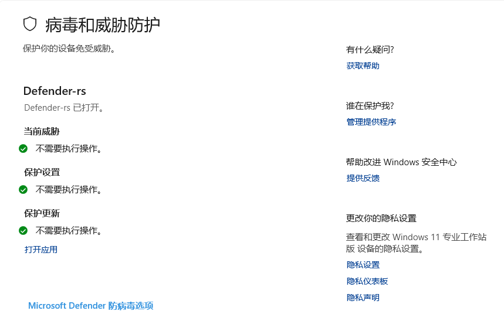

# Defender-rs: Rust Rewrite of DefendNot

An even funnier way to disable Windows Defender. Inspired by [es3n1n/defendnot](https://github.com/es3n1n/defendnot)



> [!CAUTION]
> **Permitted Use Notice**:
>
> Using this tool to facilitate malware distribution, cybercrime, unauthorized access, evading detection, or any illegal activity is strictly prohibited.
>
> Users assume all legal responsibility for how they use this tool and any consequences thereof. You must comply with all applicable local, state, federal, and international laws when using this tool.
>
> By downloading, installing, or using this tool, you acknowledge that you have read, understood, and agree to these terms.

A fully Rust rewrite of defendnot, 100% compatible with the original [C++ version](https://github.com/es3n1n/defendnot). You can use the Rust loader to inject the C++ DLL, or the C++ loader to inject the Rust DLL.

- Register/unregister custom AV/AS to Windows Security Center (WSC)
- Automatic scheduled task for persistence (boot/login)
- Minimal (Just 300kb), dependency-free

## Installation & Usage

1. Download the [latest release](https://github.com/fontlos/defender-rs/releases/latest)
2. Unzip and run `defender.exe` as administrator. Just
   ```sh
   sudo defender.exe
   ```
3. Command help
   ```shell
   Set AV display name, register AV and set autorun task
   Usage: defender.exe [--name <NAME>] [--disable] [--auto] [--on-login]

   Options:
     --name         Set AV display name (default: Defender-rs)
     --disable      Unregister AV and remove autorun task
     --auto         Silent mode (no window, used by scheduled task)
     --on-login     Schedule autorun on login (default: on boot)
   ```

When you encounter an error and need feedback, you can download the **Debug** version, which will generate logs in `C:/Windows/Temp/defender-rs-log.txt`

## How It Works

Windows Security Center (WSC) allows third-party AV/AS to register themselves. When Defender detects another AV/AS registered, it disables itself. defender-rs communicates with WSC via COM, registering a custom AV/AS product so Defender enters "protected" state.

## Limitations

- **Must stay on disk:** Scheduled task autorun requires binaries to remain for persistence after reboot.
- **No Windows Server support:** WSC is not available on Server editions, so registration is blocked.
- **Defender will flag/block:** You must temporarily disable Defender real-time/tamper protection or add an exclusion to allow the program to remain on disk and execute

## Legitimate Use Cases

- Reduce resource usage in dev/test environments
- Research/education on Windows security mechanisms
- Home lab experimentation

> [!IMPORTANT]
> No support for illegal use. You are responsible for any consequences.

## Credits

- [es3n1n](https://github.com/es3n1n) for original design and reverse engineering
- [mrbruh](https://mrbruh.com) for reverse engineering and testing
- [pindos](https://github.com/pind0s) for WSC debugging support
